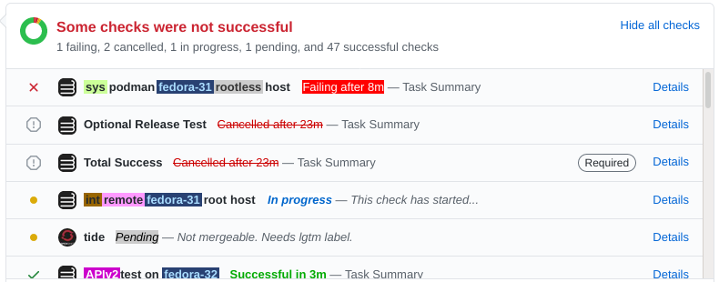

Description
===========

This greasemonkey script is intended for the podman CI setup as of
October 2020, the one with jobs named `int podman fedora-32 root host`
and whatnot. Those jobs are impossible for a human eye to distinguish,
so we highlight each category using a different color:

Basically:
* `int` and `sys` (integration/system) get different colors
* `podman` is unhighlighted because it's the usual, but `remote` is highlighted.
* `fedora` and `ubuntu` get their own colors
* `root` is unhighlighted (again, because it's the usual case) but `rootless` is highlighted
* `host` is unhighlighted (ibid) but `container` gets a color.

The highlights show up in github PR `Conversation` and `Checks` tabs.

Installing
==========

Hover over
[this link](https://raw.githubusercontent.com/edsantiago/greasemonkey/master/github-ci-highlight/github-ci-highlight.user.js)
to make sure I'm not trying to trick you. If you're OK with that,
click the link. Greasemonkey will count down a few seconds, then ask
you whether you want to install the script. Make whatever further
security checks you like, and click Yes if/when satisfied.
