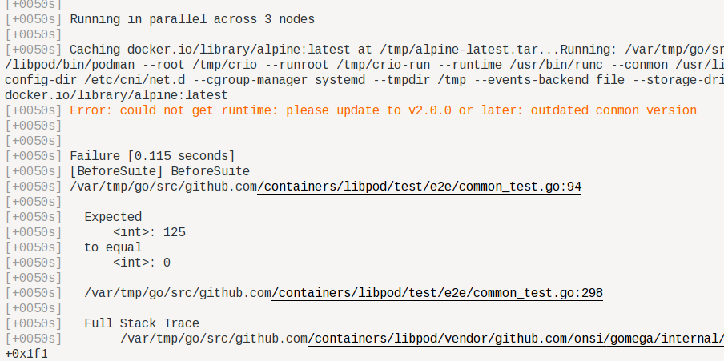

Installing
==========

Install [GreaseMonkey](https://addons.mozilla.org/en-US/firefox/addon/greasemonkey/) or, perhaps, one of the clones if you use a non-Firefox browser.

Click on the [script name](podman-ginkgo-highlight.user.js), then **Raw**
(near top right above the source code). Greasemonkey will ask if you
want to install the script. Click yes.

The script will trigger on Cirrus ginkgo logs and make them
somewhat more readable:

* It automatically scrolls to the bottom of the log, where the error summary is
* Each failure summary is a link, taking you to the full error
* Errors are highlighted in bold; warnings in orange, which makes them stand out because otherwise they're hard to see
* When possible, links to actual source code.
* Deemphasizes (light gray) boring distracting stuff like timestamps.

To be clear: script triggers only on the Cirrus logs; not on the
fancy Cirrus page with the green/red accordion expandos. You need
to click on the download-arrow just below the wide red bar.

